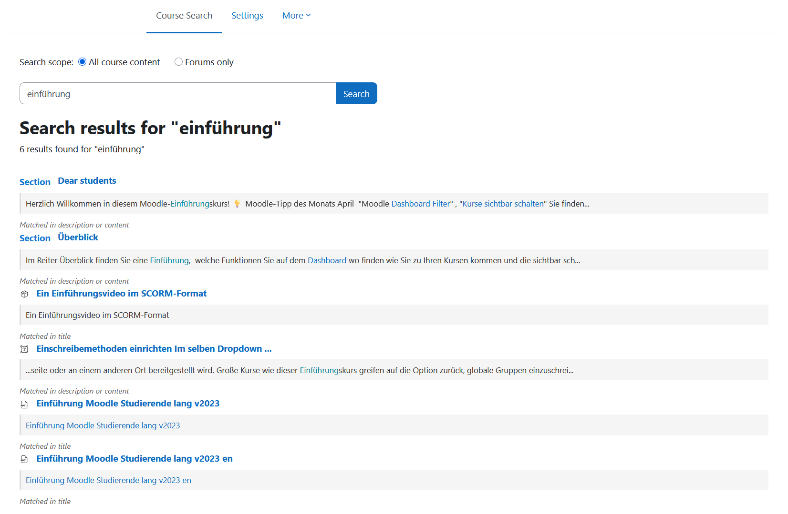
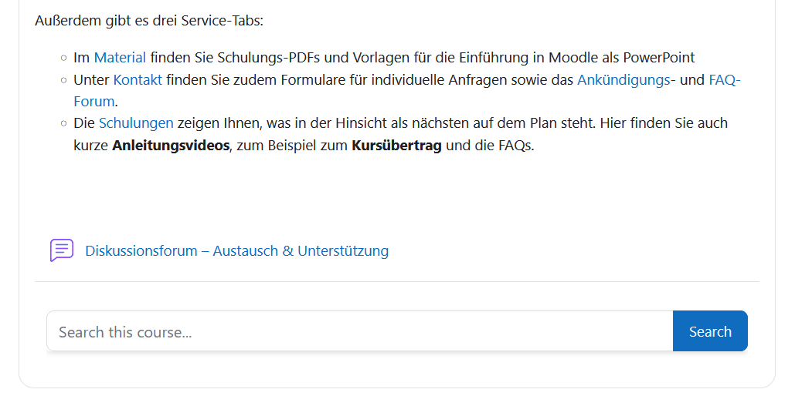

# Course Search Module for Moodle

A comprehensive Moodle activity module that enables teachers to add a search bar to courses, allowing students to search through course content with automatic highlighting of search terms.

## Features

### Core Search Functionality
- **Comprehensive Search**: Searches through all course content types
- **Search Filter**: Filter between "All content" or "Forums only" on the search page
- **Embedded Mode**: Option to embed search bar directly in course page

### Search Term Highlighting
- **Automatic Scrolling**: Automatically scrolls to matched content when clicking search results
- **Visual Highlighting**: Highlights search terms with a yellow background for 3 seconds
- **Smart Fallback**: If direct text highlighting fails (e.g., text inside links), highlights the parent element
- **Works on Course Pages**: Highlighting works for labels, pages, sections, and other content displayed on the course page
- **Accordion Support**: Automatically expands Bootstrap accordions/collapsible sections to reveal and highlight text inside

### Admin Settings
- **Enable/Disable Highlighting**: Global setting to turn scrolling and highlighting on or off (Site Administration > Plugins > Activity modules > Course Search)

## Screenshots

### Search Interface

The main search interface allows users to search through course content with filtering options.

### Embedded View

The search bar can be embedded directly on the course page for quick access.

### Scroll and Highlight Feature

When clicking on search results, the page automatically scrolls to the matched content and highlights the search terms.

## Supported Content Types

The search covers the following content types:

### Course Structure
- Course Sections (names and summaries)
- Activity and resource titles
- Descriptions and introductions

### Activities & Resources
- **Pages** (mod_page) - title and content
- **Books** (mod_book) - chapter titles and content
- **Labels** (mod_label) - content
- **Forums** (mod_forum) - discussions and posts
- **Wiki** (mod_wiki) - page titles and content
- **Lessons** (mod_lesson) - page titles and content
- **Glossary** (mod_glossary) - terms and definitions
- **Database** (mod_data) - field content
- **H5P Interactive Content** (mod_hvp) - text content from all H5P types (Accordion, Course Presentation, Quiz, etc.)
- **Folders** (mod_folder) - file names

## Requirements

- **Moodle**: 4.4 or higher
- **PHP**: 7.4 or higher
- **Browser**: Modern browser with JavaScript enabled

## Installation

### Method 1: Via Moodle Admin Interface (Recommended)

1. Download `mod_coursesearch.zip`
2. Log in to Moodle as administrator
3. Navigate to: **Site administration -> Plugins -> Install plugins**
4. Click **"Choose a file"** and upload `mod_coursesearch.zip`
5. Click **"Install plugin from the ZIP file"**
6. Review the validation report and click **"Continue"**
7. Follow the on-screen prompts to complete installation

### Method 2: Manual Installation

1. Extract the `mod_coursesearch.zip` file
2. Upload the `coursesearch` folder to `/path/to/moodle/mod/`
3. Set proper permissions: `chown -R www-data:www-data coursesearch`
4. Visit **Site administration -> Notifications**
5. Follow the upgrade prompts

## Usage

### Adding to a Course

1. Navigate to your course
2. Turn editing on
3. Click "Add an activity or resource"
4. Select "Course Search"
5. Configure settings:
   - **Name**: Display name for the search activity
   - **Description**: Optional introduction text
   - **Embedded mode**: Enable to show search form inline on course page
6. Save and display

### Supported Languages

- English
- German
- Ukrainian

### Searching

1. Open the Course Search activity (or use the embedded search bar)
2. Enter search terms
3. Select filter: "All" or "Forums only"
4. Click **"Search"**
5. Click on any result to navigate to the content

### Highlighting (Course Page Content)

When clicking on search results that link to course page content (labels, pages, sections):
- The page automatically scrolls to the matched text
- The text is highlighted with a yellow background for 3 seconds
- Bootstrap accordions/collapsible sections are automatically expanded if the text is inside

**Note**: Highlighting only works on course pages. Results linking to external pages (Book chapters, Wiki pages, Glossary entries, Database records, H5P activities) will navigate directly to the content without highlighting.

## Performance

- JavaScript only loads when needed (when `highlight` parameter is present)
- AMD modules are lazy-loaded by Moodle
- Client-side highlighting only
- Minimal impact on page load

## Troubleshooting

### Highlighting doesn't work
- Clear browser cache (Ctrl+Shift+Delete)
- Purge Moodle caches: **Site administration -> Development -> Purge all caches**
- Ensure JavaScript is enabled
- Note: Highlighting only works on course pages, not on Book/Wiki/Glossary/etc. pages

### No search results
- Verify content is visible to the user
- Try different search terms
- Check if the content type is supported

## Version

Current version: **1.0.0** (Stable)

## License

This plugin is licensed under the GNU GPL v3 or later.

## Credits

Original plugin: Yurii Lysak (2025)
Enhancements: HNEE (Hochschule f�r nachhaltige Entwicklung Eberswalde) - December 2025

## Support

For issues, feature requests, or contributions, please contact your Moodle administrator.
