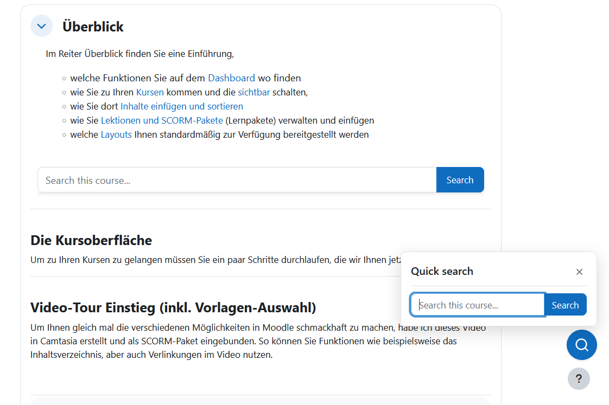
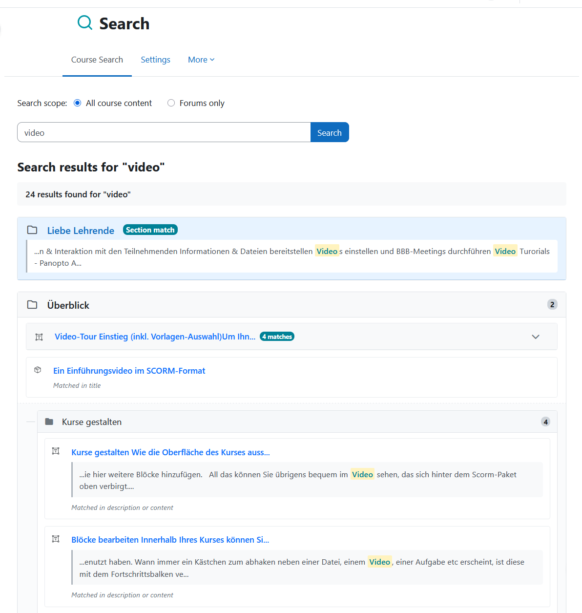
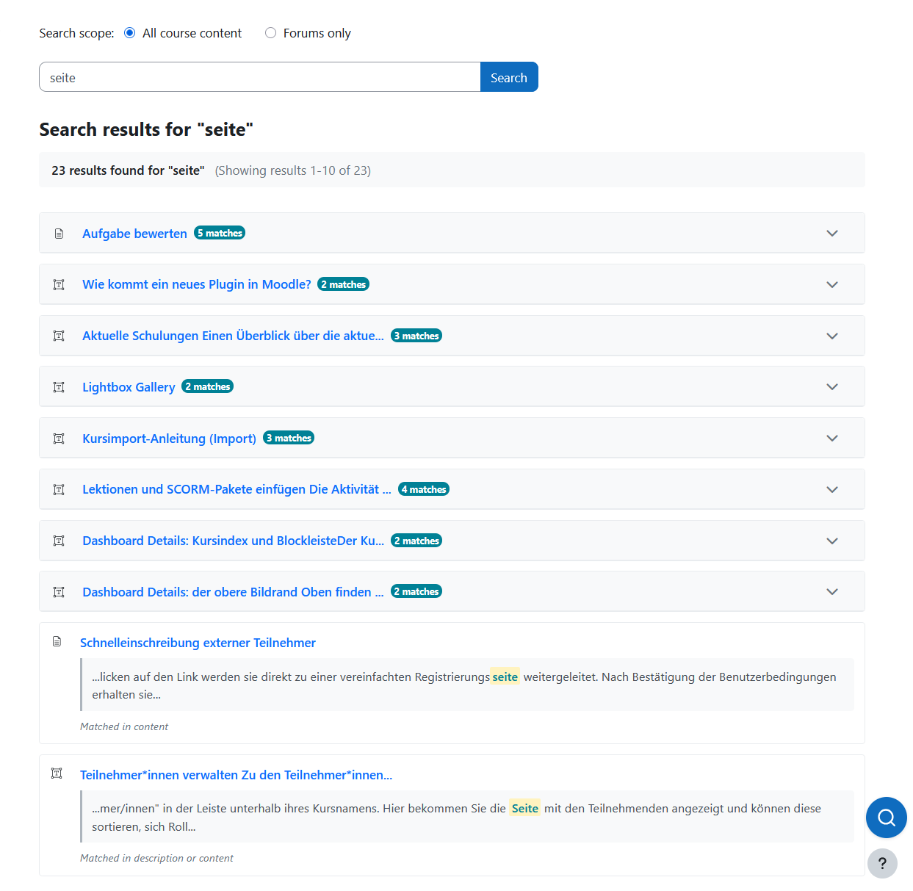
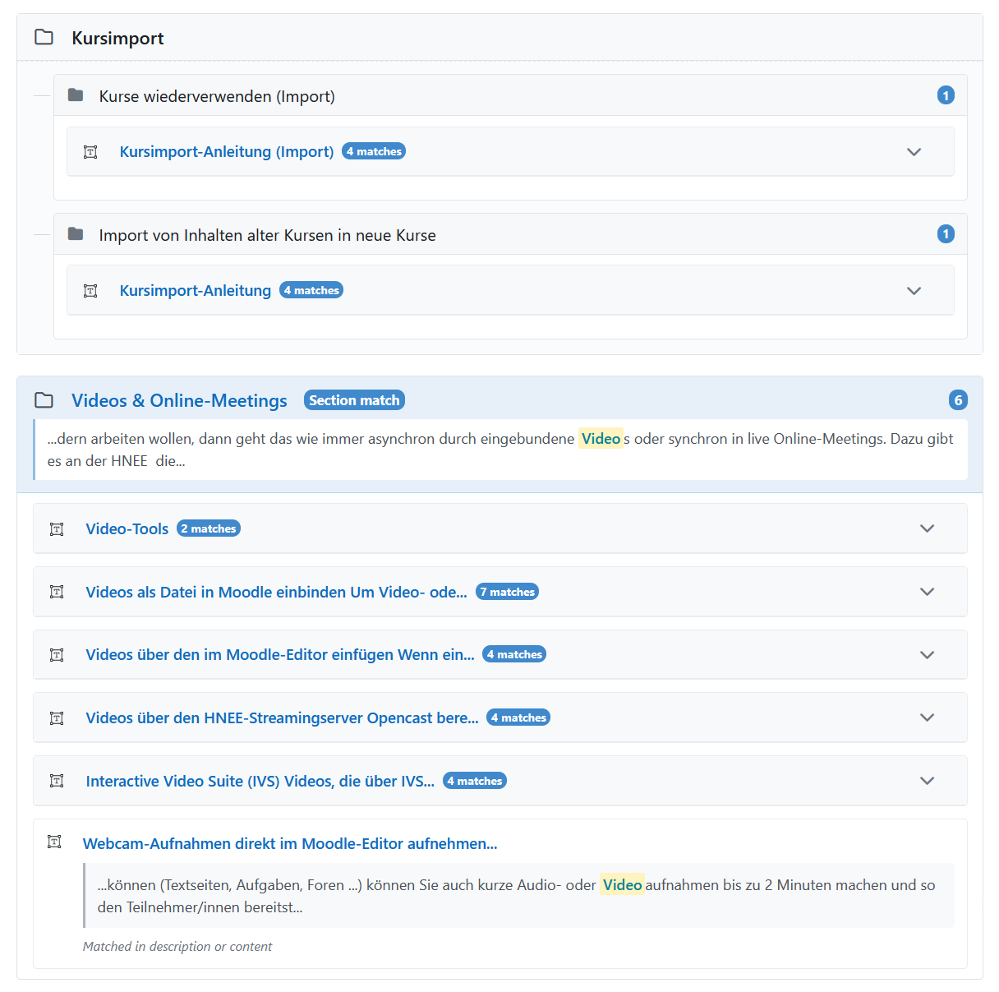
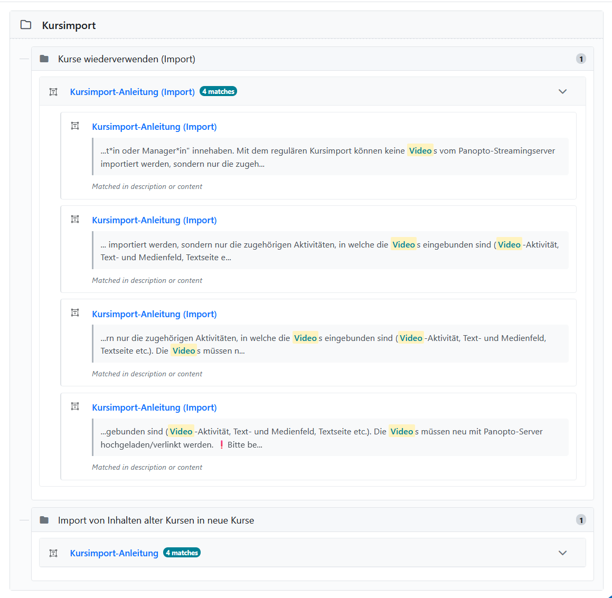
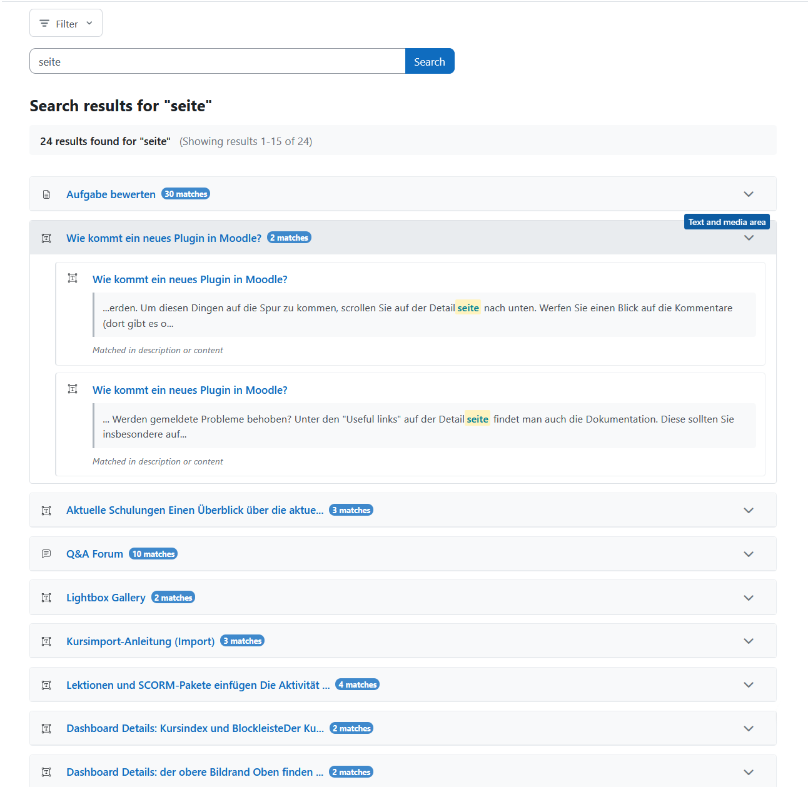
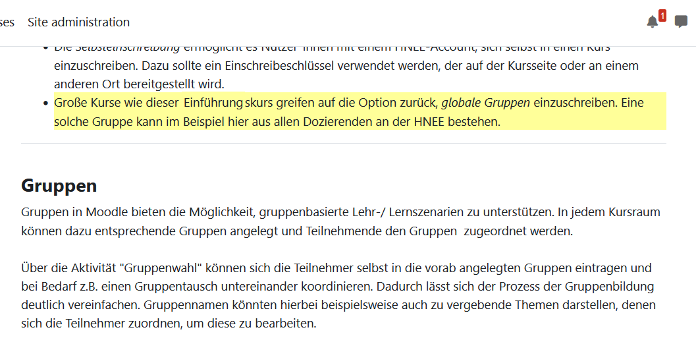
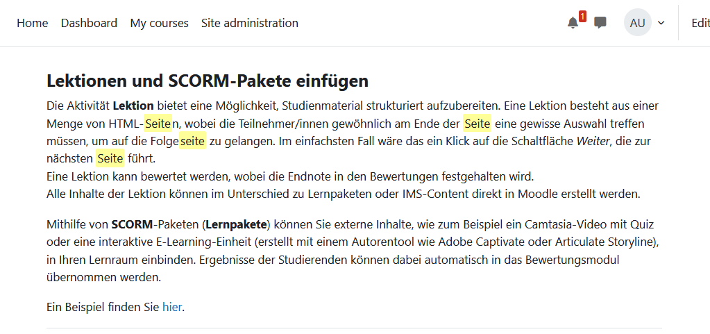
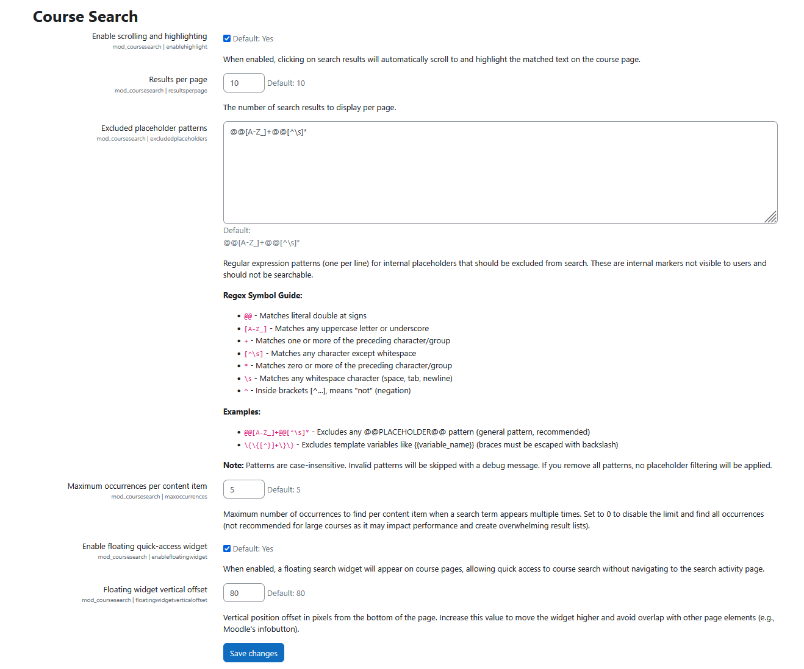
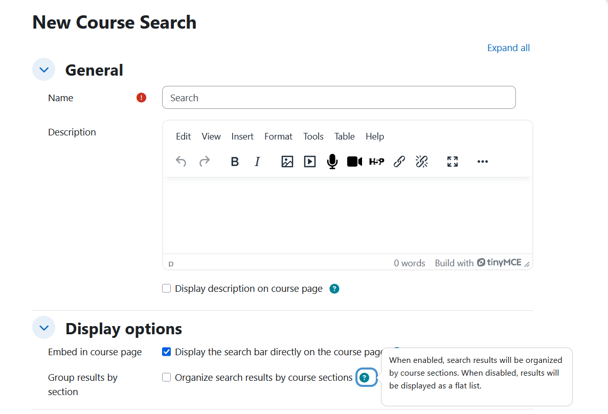

# Course Search Module for Moodle

A comprehensive Moodle activity module that enables teachers to add a search bar to courses, allowing students to search through course content with automatic highlighting of search terms.

## Features

### Core Search Functionality
- **Comprehensive Search**: Searches through all course content types
- **Search Filter**: Filter between "All content" or "Forums only" on the search page
- **Embedded Mode**: Option to embed search bar directly in course page ([screenshot](screenshots/interface_embedded_view_and_quick_access_widget.png))
- **Results Grouping**: Optional grouping of search results by course sections (can be enabled/disabled per activity) ([grouped](screenshots/search_interface_grouped_mode.png) | [flat](screenshots/search_interface_flat_mode.png))
- **Activity Grouping**: Automatic collapsible grouping of multiple matches within the same activity (e.g., multiple forum posts, book chapters, or content occurrences) ([screenshot](screenshots/search_interface_grouped_mode_activity_expanded.png))
- **Multiple Occurrences**: Finds multiple occurrences of search terms in content (configurable limit per content item, default: 5) for comprehensive results. Administrators can configure this limit or disable it in admin settings.
- **Pagination**: Large result sets are paginated for improved performance and usability (works for both grouped and ungrouped views)

### Search Term Highlighting
- **Automatic Scrolling**: Automatically scrolls to matched content when clicking search results
- **Visual Highlighting**: Highlights search terms with a yellow background for 3 seconds (or until user clicks elsewhere for grouped results)
- **Multi-Occurrence Highlighting**: ([single](screenshots/scrollhighlighted_single_occurrence.png) | [multiple](screenshots/scrollhighlighted_multiple_occurrences.png))
  - Opening grouped activity result highlights ALL occurrences of the search term. All-occurrence highlights persist until the user clicks anywhere on the page
  - Opening individual match items highlights the SPECIFIC occurrence that was clicked

- **Smart Fallback**: If direct text highlighting fails (e.g., text inside links), highlights the parent element
- **Wide Activity Support**: Highlighting works on Pages, Books, Lessons, Wiki, Forums, Glossary, Database, and Labels
- **Accordion Support**: Automatically expands Bootstrap accordions/collapsible sections to reveal and highlight text inside

### Floating Quick-Access Widget ([screenshot](screenshots/interface_embedded_view_and_quick_access_widget.png))
- **Quick Search Access**: A floating search widget appears on all course pages (course view, module pages, etc.) providing instant access to course search without navigating to the search activity page
- **Smart Positioning**: Configurable vertical offset to avoid overlap with other page elements (e.g., Moodle's infobutton)
- **Theme Integration**: Widget automatically adapts to Moodle's theme colors
- **Universal Availability**: Appears on all course pages where a coursesearch activity exists (excludes H5P pages to prevent duplication)

### Admin Settings ([screenshot](screenshots/admin_settings.png))
- **Enable/Disable Highlighting**: Global setting to turn scrolling and highlighting on or off (Site Administration > Plugins > Activity modules > Course Search)
- **Enable/Disable Floating Widget**: Global setting to turn the floating quick-access widget on or off
- **Floating Widget Vertical Offset**: Configure the vertical position of the floating widget in pixels from the bottom of the page (default: 80px)
- **Results Per Page**: Configure the number of search results displayed per page
- **Maximum Occurrences Per Content Item**: Configure how many occurrences of a search term to find per content item (default: 5). Set to 0 to disable the limit and find all occurrences (not recommended for large courses as it may impact performance)
- **Excluded Placeholder Patterns**: Configure regex patterns to exclude internal Moodle placeholders (like @@PLUGINFILE@@) from search results to prevent false matches

## Screenshots

### Embedded Search and Floating Widget

The search bar can be embedded directly on the course page. The floating quick-access widget provides instant search access from any course page.

### Search Results (Grouped Mode)

The main search interface with results grouped by course sections and collapsible activity grouping.

📸 More search interface screenshots

#### Flat Mode

#### Activity Grouping (Grouped Mode)
| Collapsed | Expanded |
|-----------|----------|
|  |  |

#### Activity Grouping (Flat Mode)

📸 Highlighting screenshots

#### Single Occurrence Highlight

#### Multiple Occurrences Highlight

📸 Settings screenshots

#### Admin Settings

#### Activity Settings

## Supported Content Types

The search covers the following content types:

### Course Structure
- Course Sections (names and summaries)
- Activity and resource titles
- Descriptions and introductions

### Activities & Resources

| Activity | Searchable Content | Highlighting |
|----------|-------------------|--------------|
| **Pages** (mod_page) | Title and content | Yes |
| **Books** (mod_book) | Chapter titles and content | Yes |
| **Labels** (mod_label) | Content | Yes |
| **Forums** (mod_forum) | Discussions and posts | Yes |
| **Wiki** (mod_wiki) | Page titles and content | Yes |
| **Lessons** (mod_lesson) | Page titles and content | Yes |
| **Glossary** (mod_glossary) | Terms and definitions | Yes |
| **Database** (mod_data) | Field content | Yes |
| **H5P** (mod_hvp, mod_h5pactivity) | Text from all H5P types | No |
| **Folders** (mod_folder) | File names | No |

## Requirements

- **Moodle**: 4.4 or higher
- **PHP**: 7.4 or higher
- **Browser**: Modern browser with JavaScript enabled

## Installation

### Method 1: Via Moodle Admin Interface (Recommended)

1. Download `mod_coursesearch.zip`
2. Log in to Moodle as administrator
3. Navigate to: **Site administration -> Plugins -> Install plugins**
4. Click **"Choose a file"** and upload `mod_coursesearch.zip`
5. Click **"Install plugin from the ZIP file"**
6. Review the validation report and click **"Continue"**
7. Follow the on-screen prompts to complete installation

### Method 2: Manual Installation

1. Extract the `mod_coursesearch.zip` file
2. Upload the `coursesearch` folder to `/path/to/moodle/mod/`
3. Set proper permissions: `chown -R www-data:www-data coursesearch`
4. Visit **Site administration -> Notifications**
5. Follow the upgrade prompts

## Usage

### Adding to a Course

1. Navigate to your course
2. Turn editing on
3. Click "Add an activity or resource"
4. Select "Course Search"
5. Configure settings ([screenshot](screenshots/activity_settings.png)):
   - **Name**: Display name for the search activity
   - **Description**: Optional introduction text
   - **Embedded mode**: Enable to show search form inline on course page
   - **Group results by section**: Enable to organize results by course sections, or disable for a flat list view
6. Save and display

### Supported Languages

- English
- German
- Ukrainian

### Searching

1. Open the Course Search activity (or use the embedded search bar)
2. Enter search terms
3. Select filter: "All" or "Forums only"
4. Click **"Search"**
5. Browse results (grouped by sections if enabled, or as a flat list if disabled)
6. Use pagination controls to navigate through multiple pages of results
7. Click on any result to navigate to the content

### Highlighting

When clicking on search results, the plugin automatically:
- Scrolls to the matched text
- Highlights the text with a yellow background
- Expands Bootstrap accordions/collapsible sections if needed

**Highlighting Modes:**
- **All Occurrences**: When opening a group activity result (e.g., "Activity Name - 3 matches"), all occurrences of the search term are highlighted and remain visible until you click anywhere on the page
- **Specific Occurrence**: When opening an individual match from an expanded accordion, only that specific occurrence is highlighted (auto-removes after 3 seconds)

**Highlighting works on:**
- Course page (Labels, Sections)
- Pages, Books, Lessons
- Wiki pages
- Forum discussions and posts
- Glossary entries
- Database records

**Highlighting does NOT work on:**
- H5P activities (content is rendered in an iframe)
- Folder files (links to file downloads)

## Performance

- JavaScript only loads when needed (when `cs_highlight` parameter is present)
- AMD modules are lazy-loaded by Moodle
- Client-side highlighting only
- Minimal impact on page load

## Troubleshooting

### Highlighting doesn't work
- Clear browser cache (Ctrl+Shift+Delete)
- Purge Moodle caches: **Site administration -> Development -> Purge all caches**
- Ensure JavaScript is enabled
- Check if highlighting is enabled in admin settings
- Note: Highlighting does NOT work on H5P activities (iframe limitation) or Folder files (file downloads)

### No search results
- Verify content is visible to the user
- Try different search terms
- Check if the content type is supported

## Version

Current version: **1.4.5** (Build: 2026011602, Stable)

For detailed version history, see [CHANGES.md](CHANGES.md).

View enhancement history

### Enhancements (December 2025)
- Extended highlighting support to Pages, Books, Lessons, Wiki, Forums, Glossary, and Database activities
- Added search results pagination and grouping by sections

### Enhancements (January 2026)
- Added floating quick-access search widget with admin settings for enabling/disabling it and configuring its vertical offset position
- Added optional grouping toggle allowing teachers to choose between grouped or flat list result display
- Fixed HTML tag and placeholder matching bugs, improving search accuracy
- Added configurable placeholder filtering for administrators
- Added collapsible activity grouping for multiple matches within the same activity
- Enhanced search to find all occurrences of search terms in content & added configuration for admins to limit maximum occurrences per content item
- Improved search logic across all activity types for better result coverage
- Added multi-occurrence highlighting - opening grouped result highlights all occurrences (persists until click), opening individual match highlights specific occurrences

## License

This plugin is licensed under the [GNU GPL v3 or later](LICENSE).

## Credits

Original plugin: Yurii Lysak (2025)
HNEE (Hochschule für nachhaltige Entwicklung Eberswalde)

## Support

For issues, feature requests, or contributions, please contact your Moodle administrator.
