# Course Search Module for Moodle

A Moodle activity module that lets students search the content of a course and jump straight to a match, which is highlighted on the target page. Teachers add a search bar to a course as an activity; administrators can additionally enable a floating quick-access widget across every course on the site, so a course is searchable even without the activity.

## Features

**Search**
- Searches across all supported course content types (see [Supported content](#supported-content)).
- **Module type filter** — narrow results to specific activity or resource types via a
  chip-based panel.
- **Embedded mode** — show the search bar inline on the course page.
- **Floating widget** — a quick-access search box on course pages, with a configurable
  vertical offset and automatic theme colors.
- **Site-wide search** — administrators can enable the widget in every course (course-scope search).
- **Result grouping** — group results by course section or show a flat list (per activity);
  multiple matches in one activity collapse into a single expandable entry.
- **Pagination** for large result sets, in both grouped and flat views.

**Highlighting**
- Scrolls to and highlights matched text, expanding any collapsible/accordion sections.
- Opening a grouped result highlights *all* occurrences (until you click away); an individual
  match highlights just that one (3 seconds).
- Falls back to the parent element when inline text can't be highlighted directly.

**Configuration** *(Site administration → Plugins → Activity modules → Course Search)*
- Toggle highlighting and the floating widget on or off; set the widget's vertical offset.
- Choose where the widget appears: only in courses that contain a Course Search activity
  (default), or in every course on the site.
- Hide the widget in chosen activity types (e.g. quizzes, where a course-wide search during
  an attempt is undesirable). New installations start with quizzes and Course Search itself.
- Set the default result layout (grouped by section or flat) for courses searched without an
  activity; new activities also start from this value.
- Set results per page and the maximum occurrences matched per content item (`0` = unlimited).
- Define regex patterns to exclude internal placeholders (e.g. `@@PLUGINFILE@@`) from results.

## Screenshots

### Embedded Search and Floating Widget
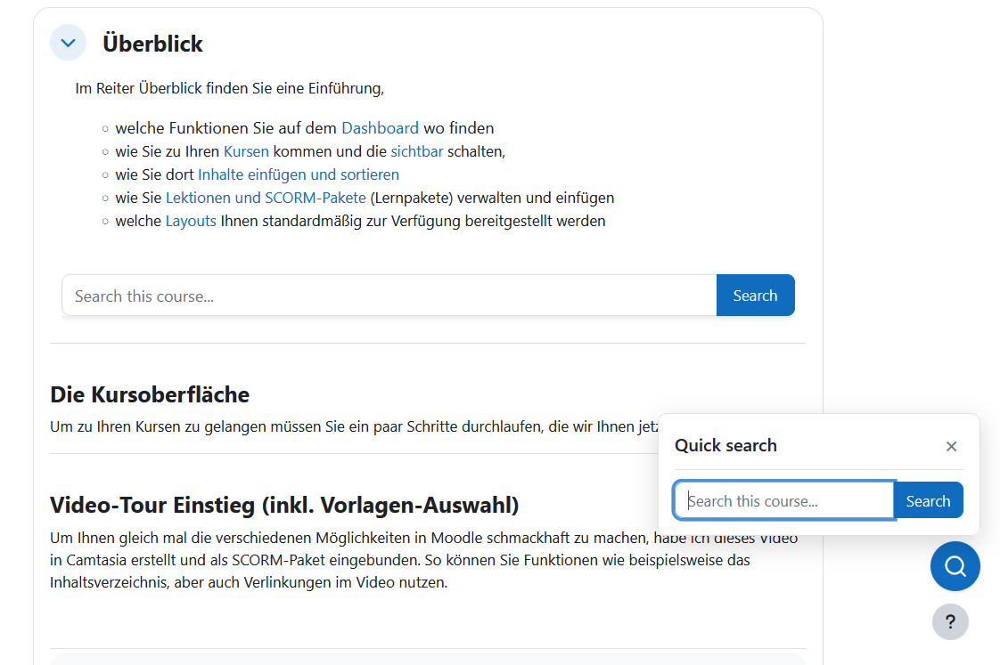

The search bar can be embedded directly on the course page. The floating quick-access widget provides instant search access from any page of a course it is enabled in.

### Search Results (Grouped Mode)
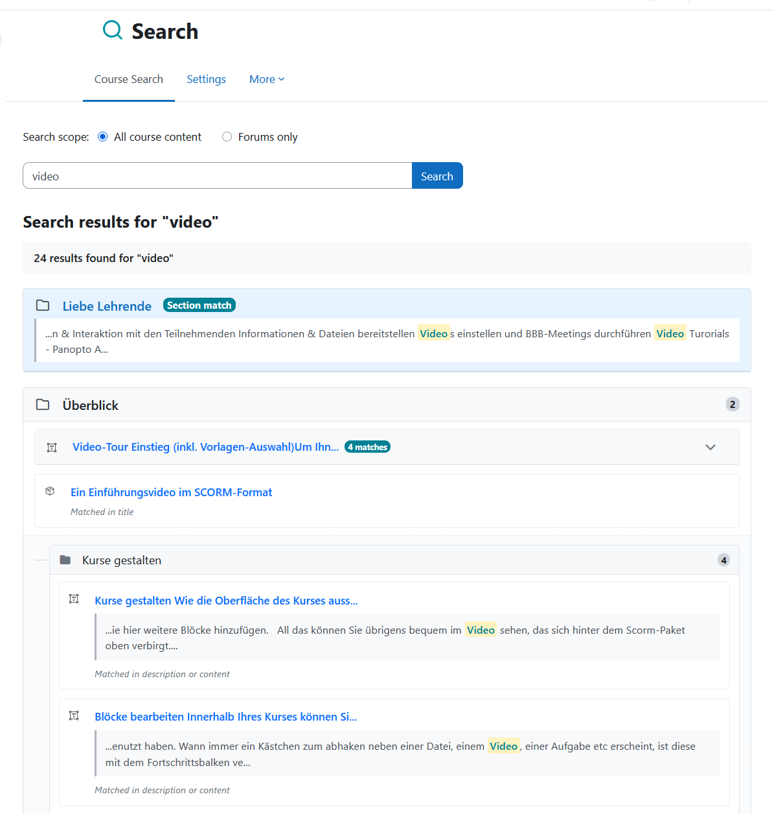

The main search interface with results grouped by course sections and collapsible activity grouping.

<strong>📸 More search interface screenshots ▼</strong>

#### Module Type Filter
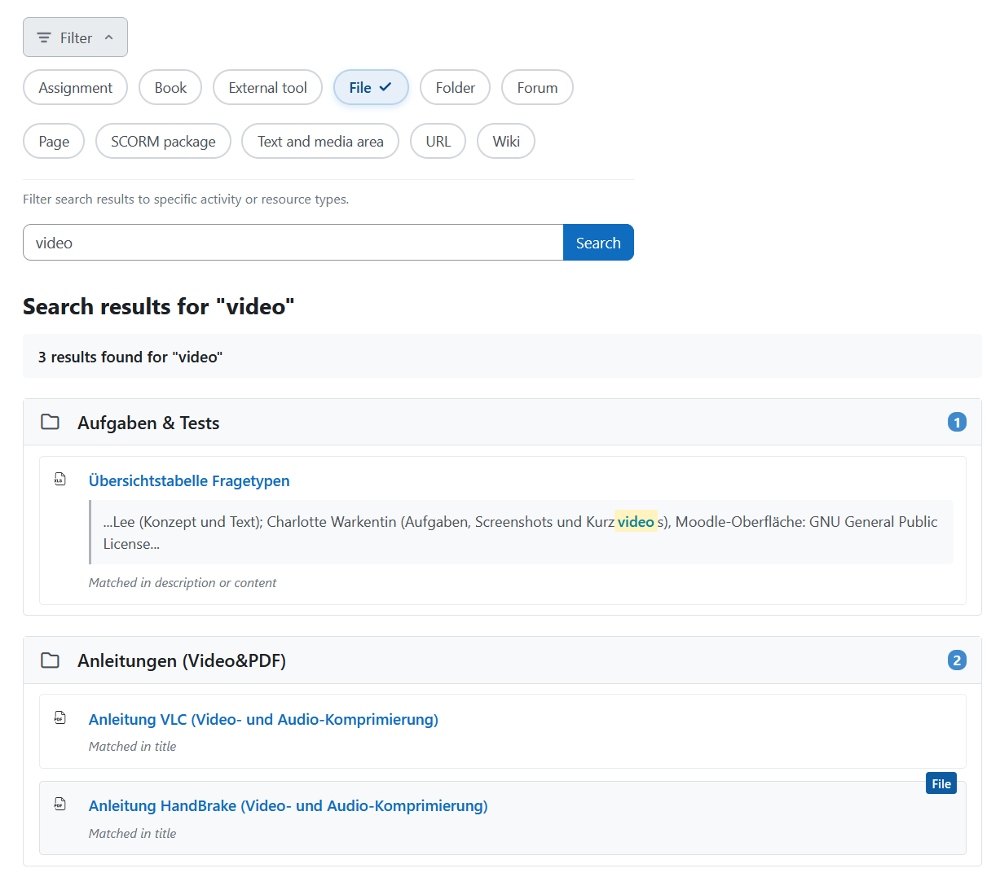

The collapsible filter panel allows users to select specific activity or resource types to narrow down search results. Selected filters are highlighted with theme colors.

#### Flat Mode
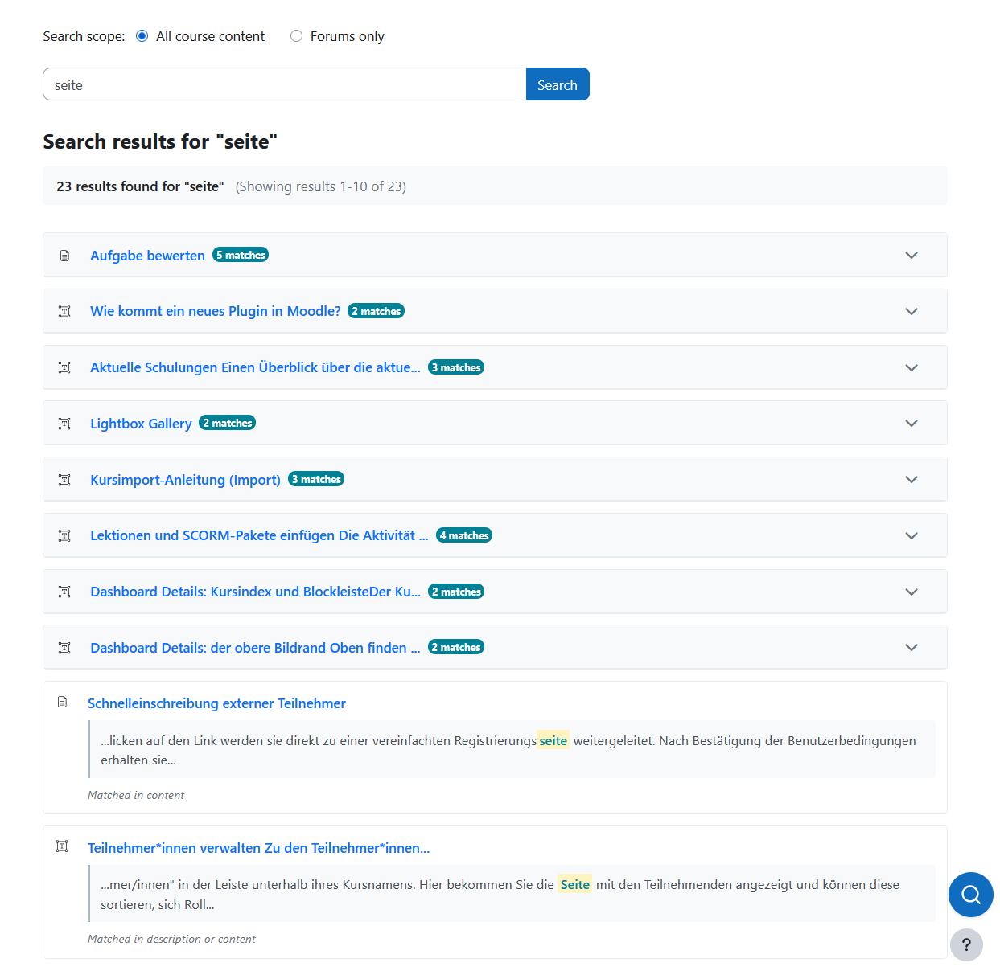

#### Activity Grouping (Grouped Mode)
| Collapsed | Expanded |
|-----------|----------|
| 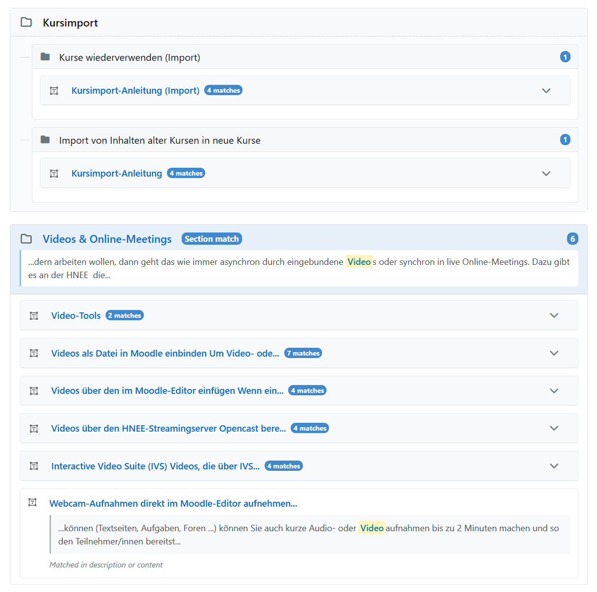 | 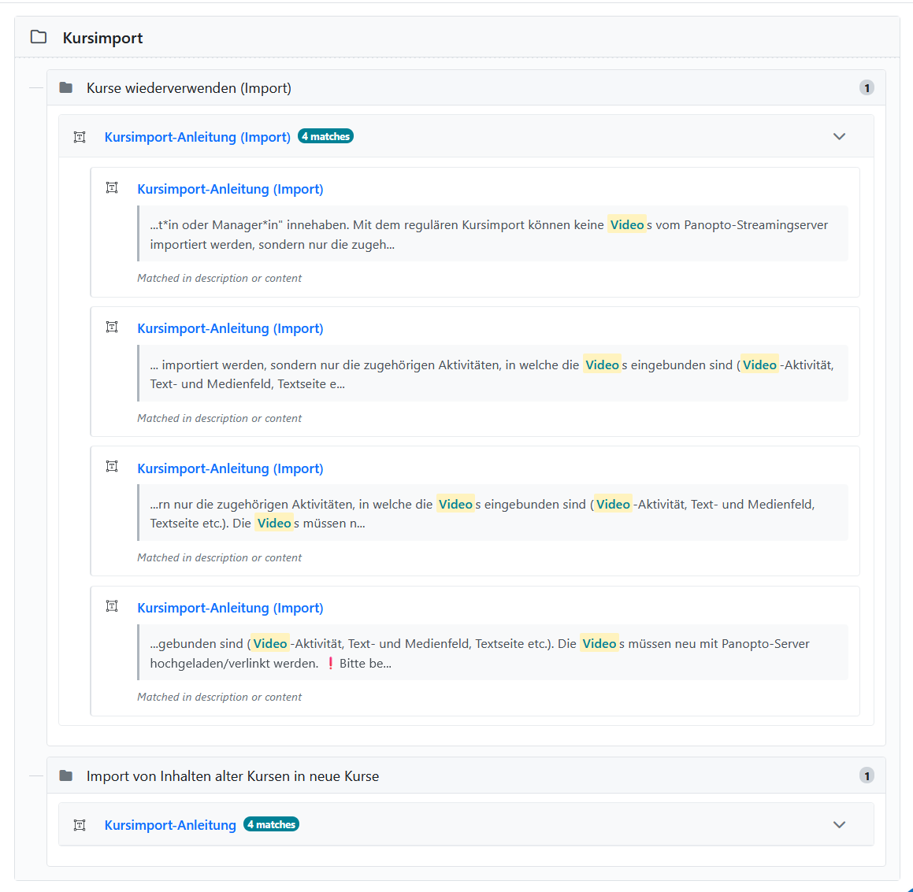 |

#### Activity Grouping (Flat Mode)
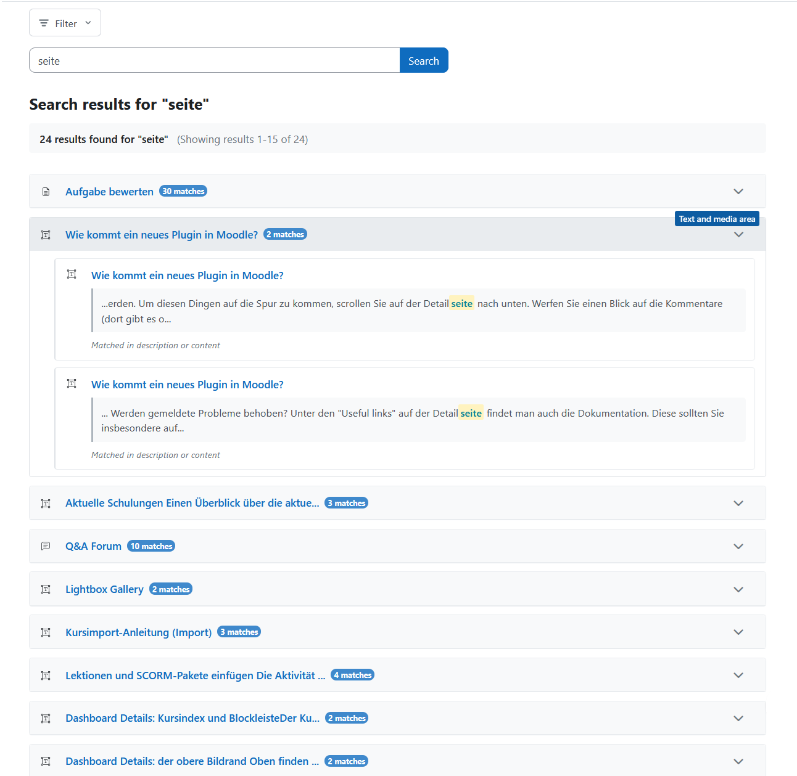

<strong>📸 Highlighting screenshots ▼</strong>

#### Single Occurrence Highlight
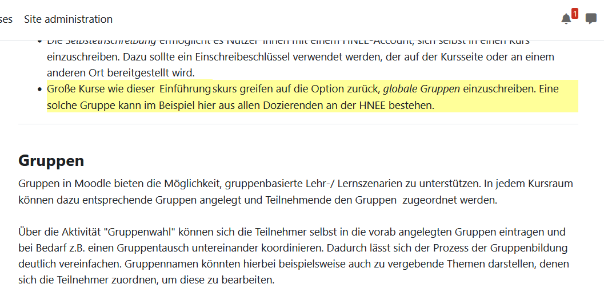

#### Multiple Occurrences Highlight
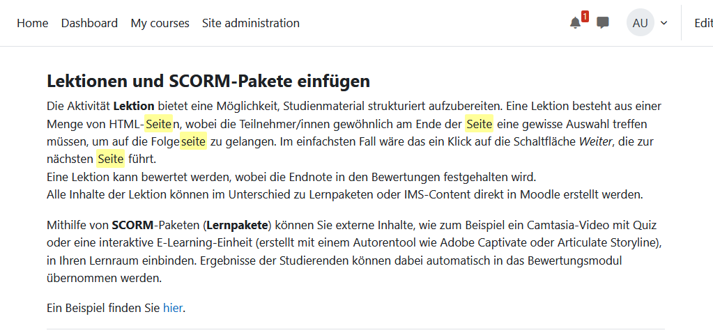

<strong>📸 Settings screenshots ▼</strong>

#### Admin Settings
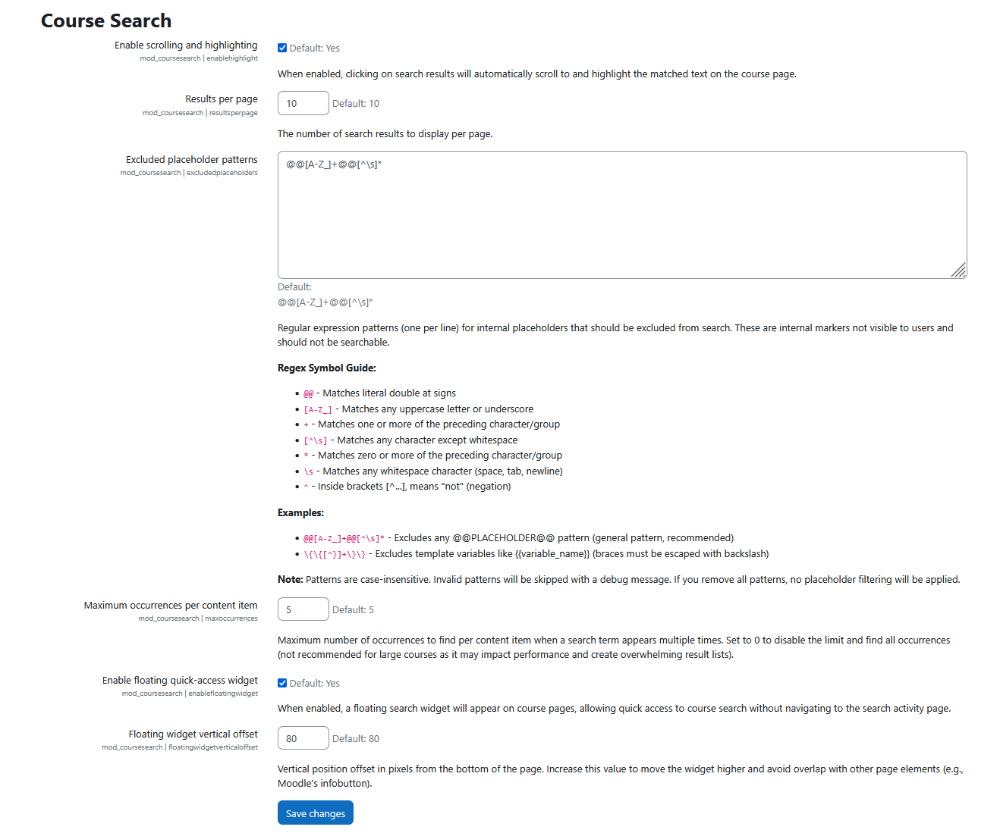

#### Activity Settings
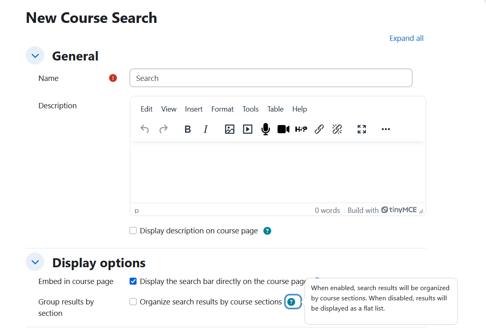

## Supported content

Section names and summaries, and every activity/resource title and description are searched.
Per-activity coverage:

| Activity | Searchable content | Highlighting |
|----------|-------------------|--------------|
| **Pages** (mod_page) | Title and content | Yes |
| **Books** (mod_book) | Chapter titles and content | Yes |
| **Labels** (mod_label) | Content | Yes |
| **Forums** (mod_forum) | Discussions and posts | Yes |
| **Wiki** (mod_wiki) | Page titles and content | Yes |
| **Lessons** (mod_lesson) | Page titles and content | Yes |
| **Glossary** (mod_glossary) | Terms and definitions | Yes |
| **Database** (mod_data) | Field content | Yes |
| **H5P** (mod_hvp, mod_h5pactivity) | Text from all H5P types | No |
| **Folders** (mod_folder) | File names | No |

## Requirements

- **Moodle**: 4.4 or higher
- **PHP**: 8.0 or higher (as required by Moodle 4.4)
- **Browser**: Modern browser with JavaScript enabled

## Installation

1. Install the plugin either way:
   - **Admin UI:** *Site administration → Plugins → Install plugins*, then upload
     `mod_coursesearch.zip`.
   - **Manual:** extract the `coursesearch` folder into `/path/to/moodle/mod/`.
2. Visit *Site administration → Notifications* and complete the upgrade prompts.

## Usage

### Adding to a Course

1. Navigate to your course
2. Turn editing on
3. Click "Add an activity or resource"
4. Select "Course Search"
5. Configure settings ([screenshot](screenshots/activity_settings.png)):
   - **Name**: Display name for the search activity
   - **Description**: Optional introduction text
   - **Embedded mode**: Enable to show search form inline on course page
   - **Group results by section**: Enable to organize results by course sections, or disable for a flat list view
6. Save and display

### Enabling the widget site-wide (administrators)

The floating widget is on by default and appears in courses that contain a Course Search
activity. To make every course searchable without teachers adding anything:

1. Go to *Site administration → Plugins → Activity modules → Course Search*
2. Set **Show the widget in** to "All courses"
3. Optionally set up **Hide the widget in these activities** to keep the widget off pages where it is unwanted

In a course without the activity the widget opens a course-level search page instead of an
activity page.

### Searching

Open the activity (or use the embedded/floating search bar), optionally click **Filter** to
limit results to specific activity types, enter your terms, and search. Results appear grouped
by section or as a flat list (per the activity's setting, or the site default in courses
without an activity) and are paginated. Click any result to jump to the content.

### Highlighting

Clicking a result scrolls to the matched text, highlights it with a yellow background, and
expands any collapsible sections as needed. Opening a grouped result highlights *all*
occurrences (until you click away); opening an individual match highlights just that one (for
3 seconds). See [Features](#features) for the full list of supported activities.

## Performance

- JavaScript only loads when needed (highlighting only when the `cs_highlight` parameter is
  present, widget code only on pages that actually render the widget)
- AMD modules are lazy-loaded by Moodle
- Client-side highlighting only
- Minimal impact on page load

## Troubleshooting

**Highlighting doesn't work** — ensure JavaScript is enabled and highlighting is on in the
admin settings, then clear your browser cache and purge Moodle caches
(*Site administration → Development → Purge all caches*). Note that highlighting is not
supported on H5P (iframe) or Folder (file download) activities.

**The floating widget doesn't appear** — check that it is enabled in the admin settings, that
**Show the widget in** matches the course (courses with the activity only, or all courses), and
that the current activity type is not listed under **Hide the widget in these activities**. The
widget is never shown on the site front page, nor on SCORM player, H5P player or content bank
pages.

**No search results** — confirm the content is visible to the user, the content type is
supported, and try alternative search terms.

## Version

Current version: **1.5.1** (Build: 2026090404, Stable)

For detailed version history, see [CHANGES.md](CHANGES.md).

## License

This plugin is licensed under the [GNU GPL v3 or later](LICENSE).

## Credits

Original plugin: Yurii Lysak (2025)
HNEE (Hochschule für nachhaltige Entwicklung Eberswalde)

## Contributing & Support

### Bug reports & feature requests

Use the [GitHub issue tracker](https://github.com/lysak-yurii/moodle-mod_coursesearch/issues)
to report bugs or suggest features. Please check for an existing issue before opening a new one.

### Contributing

Contributions are welcome — fork the repo, create a feature branch, and open a pull request.
Translations are especially appreciated (the plugin currently ships English, German, and
Ukrainian). By contributing you agree that your work is licensed under the GNU GPL v3 or later.

### Discussion & feedback

The plugin is listed on the [Moodle plugins directory](https://moodle.org/plugins/mod_coursesearch)
— feel free to leave reviews or comments there.
